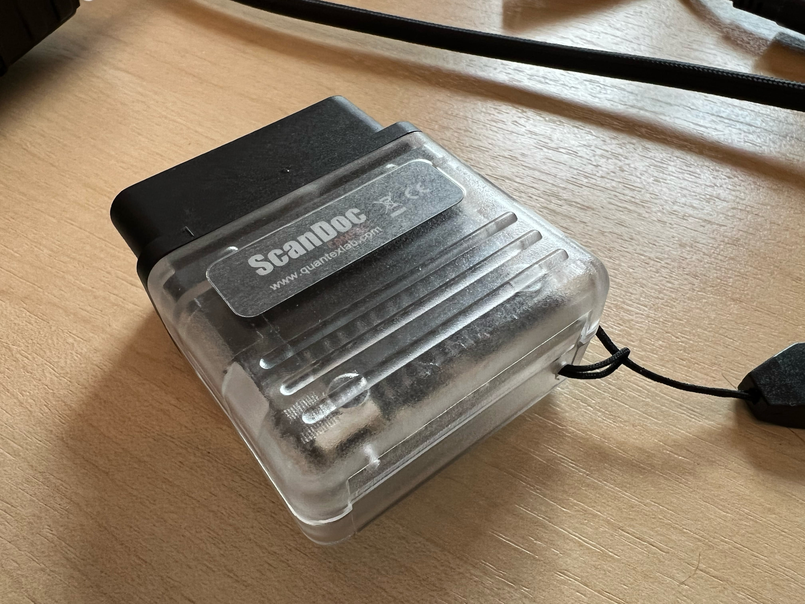

# Reverse Engineering the ScanDoc Compact J2534 Passthru Adapter



The ScanDoc (Compact) is a J2534 Passthru Adapter manufactured by [QuantexLab](https://www.quantexlab.ru).
It is a powerful small adapter that communicates via WiFi.
Being a J2534 Passthru adapter as specified by the SAE, it comes with a closed source Win32 dynamic library that offers
the J2534 API. On request, you'll also get a closed source macOS/iOS library ­– which doesn't work quite right though.

Unfortunately the _native_ TCP protocol is not documented, which is quite sad since the hardware is of very high
quality ­– it even supports OBD2 sockets in trucks, which are 24V powered (don't try this with off-the-shelf OBD2 adapters).
This is an effort to document this TCP protocol in order to make the adapter more versatile.

Personally, I no longer work with the device, but leave that information here for anyone else to contribute.

## TCP Service

- By default, the unit configures itself as 192.168.1.3 and hands out DHCP addresses in that range.
- There is a configuration web interface running on port 80 and a TCP service listening on port 58442.
- The default PassThru communication endpoint is `192.168.1.3:58442`

## Communication

- Command/Response frames seem to have a strict format of variable length

  - First byte is always 0x55 (ATT)

  - Second byte is a passthrough command
    - 0x41 (PASSTHRU OPEN CHANNEL)
    - 0x42 (PASSTHRU CLOSE CHANNEL)
    - 0x43 (PASSTHRU READ MESSAGES)
    - 0x44 (PASSTHRU WRITE MESSAGES)
    - 0x45 (PASSTHRU START PERIODIC MSG)
    - 0x46 (PASSTHRU STOP PERIODIC MSG)
    - 0x47 (PASSTHRU START MESSAGE FILTER)
    - 0x48 (PASSTHRU STOP MESSAGE FILTER)
    - 0x49 (PASSTHRU READ VERSION)
    - 0x4A (IOCTL)
    - 0x4B (START BOOT)
    - 0x53 (SET PROGRAMMING VOLTAGE) – not implemented!
    - 0x54 (PASSTHRU CONNECT)
    - PASSTHRU DISCONNECT does not to do anything on the wire.

  - Third byte is the payload length (LEN) [-2: not including the terminal STOP STOP]

  - Fourth byte is a sequence number
    - CLIENT starts w/ 0x00 in connection request
    - SERVER answers w/ 0x20 in first response
    - CLIENT always takes sequence number from last response
    - SERVER adds 0x20 on top, etc.

  - Then comes the payload with variable length

  - Penultimate byte is 0x00 (STOP)

  - Last byte is 0x00 (STOP)

### Supported Protocols

The supported protocols come straight from the J2534 definition:

```c
#define J1850VPW                                        1
#define J1850PWM                                        2
#define ISO9141                                         3
#define ISO14230                                        4
#define CAN                                             5
#define ISO15765                                        6
#define SCI_A_ENGINE                                    7
#define SCI_A_TRANS                                     8
#define SCI_B_ENGINE                                    9
#define SCI_B_TRANS                                     10
```

### Supported Channel Connection Flags

TBD

### Supported IOCTL IDs

```c
#define GET_CONFIG								0x01	// pInput = SCONFIG_LIST, pOutput = NULL
#define SET_CONFIG								0x02	// pInput = SCONFIG_LIST, pOutput = NULL
#define READ_VBATT								0x03	// pInput = NULL, pOutput = unsigned long
#define FIVE_BAUD_INIT							0x04	// pInput = SBYTE_ARRAY, pOutput = SBYTE_ARRAY
#define FAST_INIT								0x05	// pInput = PASSTHRU_MSG, pOutput = PASSTHRU_MSG
#define CLEAR_TX_BUFFER							0x07	// pInput = NULL, pOutput = NULL
#define CLEAR_RX_BUFFER							0x08	// pInput = NULL, pOutput = NULL
#define CLEAR_PERIODIC_MSGS						0x09	// pInput = NULL, pOutput = NULL
#define CLEAR_MSG_FILTERS						0x0A	// pInput = NULL, pOutput = NULL
#define CLEAR_FUNCT_MSG_LOOKUP_TABLE			0x0B	// pInput = NULL, pOutput = NULL
#define ADD_TO_FUNCT_MSG_LOOKUP_TABLE			0x0C	// pInput = SBYTE_ARRAY, pOutput = NULL
#define DELETE_FROM_FUNCT_MSG_LOOKUP_TABLE		0x0D	// pInput = SBYTE_ARRAY, pOutput = NULL
#define READ_PROG_VOLTAGE						0x0E	// pInput = NULL, pOutput = unsigned long
```

### Supported Message Filter Types

```c
#define PASS_FILTER							0x00000001
#define BLOCK_FILTER						0x00000002
#define FLOW_CONTROL_FILTER			0x00000003
```

### CONNECT TO THE DEVICE

```
00000000  55 54 00 00 00                                     UT...

00000000  55 54 04 20 00 00 00 00  00                        UT. .... .
```

- Request
  - 55 ATT
  - 54 CONNECT
  - 00 No more Payload coming in
  - 00 00 STOP STOP
- Response
 - 55 ATT
 - 54 CONNECT
 - 04 LEN = 4
 - 20 SEQ
 - 00
 - 00
 - 00
 - 00 00 STOP STOP

### READ VERSION

- Request
  - 55 ATT
  - 49 READ VERSION
  - 00 No more payload
  - 00 00 STOP STOP
- Response
  - 55 ATT
  - 49 READ VERSION
  - 0c LEN = 12
  - 20 SEQ
  - 00 00 04 ff => Hardware version 0000ff04
  - 1b 00 => Firmware version 27 (0x1b)
  - 00 00 5f 1b => Serial Number 7007 (0x1b5f)
  - 00
  - 00 00 STOP STOP

### OPEN CHANNEL

```
00000005  55 41 08 20 06 00 00 00  20 a1 07 00 00            UA. ....  ....

00000009  55 41 04 40 00 00 01 00  00                        UA.@.... .
```

    
  - Request
  - 55 ATT
  - 41 OPEN CHANNEL
  - 08 LEN = 8 (const)
  - 20 SEQ
  - 05 00 => Protocol CAN (0x05)
  - 00 00 => FLAGS
  - 20 A1 07 => Baudrate
  - 00 00 STOP STOP
- Response (positive)
  - 55 ATT
  - 41 OPEN CHANNEL
  - 04 LEN
  - 40 SEQ
  - 00 ERRCODE
  - 00 PAD?
  - 01 CHANNEL
  - 00 00 STOP STOP
- Response (negative)
  - 55 ATT
  - 41 OPEN CHANNEL
  - 02 LEN
  - 40 SEQ
  - 03 ERRCODE
  - 00 00 STOP STOP

### IOCTL

- Request
  - 55 ATT
  - 4A IOCTL
  - 08 LEN
  - 40 SEQ
  - 01 CHANNEL
  - 00
  - 0A IOCTL ID
  - 00
  - 00
  - 00
  - 00
  - 00 00 STOP STOP

### START MESSAGE FILTER

```
0000001F  55 47 28 60 01 00 00 00  03 00 00 00 00 00 00 00   UG(`.... ........
0000002F  40 00 00 00 ff ff ff ff  ae 00 00 ae 00 00 00 00   @....... ........
0000003F  00 00 07 e8 00 00 00 00  00 00 00 00 00            ........ .....

00000012  55 4a 08 60 00 00 01 00  00 00 40 00 00            UJ.`.... ..@..
```

- Request
  - 55 ATT
  - 47 START MESSAGE FILTER
  - 28 LEN (fixed)
  - 40 SEQ
  - 01 CHANNEL
  - 00 00 00 03 FILTER TYPE (FlowControlFilter)
  - 00 ???
  - 00 00 00 00 FLOW CONTROL PATTERN
  - 00 00 ???
  - 40 00 00 00 MASK FLAG
  - FF FF FF FF MASK PATTERN
  - AE 00 00 AE 00 00 00 00 ???
  - 00 00 07 E8 RECEIVE PATTERN
  - 00 00 00 00  00 00 00 ???
  - 00 00 STOP STOP
  
- Response (positive)
  - 55 ATT
  - 47 START MESSAGE FILTER
  - 04 LEN
  - 60 SEQ
  - 00 ERRCODE
  - 00 ?
  - 00 ?
  - 00 00 STOP STOP
- Response (negative)
  - 55 ATT
  - 47 START MESSAGE FILTER
  - 02 LEN
  - 60 SEQ
  - 02 ERRCODE
  - 00 00 STOP STOP

### READ MESSAGES

- Request
  - 55 ATT
  - 43 READ MESSAGES
  - 08 LEN (const)
  - 60 SEQ
  - 01 CHANNEL
  - 00 PAD?
  - 02 00 NUMBER OF MESSAGES TO READ => 02 (uint32)
  - 88 77 66 55 => Timeout in milliseconds uint32
  - 00 STOP
- Response (positive)
    - 55 ATT
    - 43 READ
    - 3c LEN
    - 80 SEQ
    - 00 ERRCODE
    - 00 PAD?
    - 02 00 NUMBER OF MESSAGES COMING
    - 05 00 PROTOCOL
    - 00
    - 00
    - ed 06 4e 02 => TIMESTAMP (uint32)
    - 0c 00 => DataSize including header (12) (uint16)
    - 0c 00 => ExtraDataIndex (12) (uint6)
    - 00 00 07 df => ID (uint32)
    - 02 D1 (PCI)
    - 01 D2
    - 00 D3
    - 55 D4
    - 55 D5
    - 55 D6
    - 55 D7
    - 55 D8
    - 00
    - 00
    - 00
    - 00
    - 05 00 PROTOCOL
    - 00
    - 00
    - f1 06 4e 02 => TIMESTAMP
    - 0c 00 => DataSize including header (12) (uint16)
    - 0c 00 => ExtraDataIndex (12) (uint6)
    - 00 00 07 e8 => ID (uint32)
    - 06 D1 (PCI)
    - 41 D2
    - 00 D3
    - b8 D4
    - 7b D5
    - 30 D6
    - 10 D6
    - 00 D7
    - 00 D8
    - 00
    - 00
    - 00 00 STOP STOP

- Response (negative)
  - 55 ATT
  - 43 READ MESSAGE
  - 04 LEN
  - 80 SEQ
  - 09 ERRCODE

### WRITE MESSAGES

```
00000059  55 44 18 a0 01 00 01 00  e8 03 00 00 06 00 40 00   UD...... ......@.
00000069  06 00 00 00 00 00 07 df  01 00 00 00 00            ........ .....
    
00000035  55 44 04 c0 00 00 01 00  00                        UD...... .
```

- Request
  - 55 ATT
  - 44 WRITE MESSAGES
  - 18 LEN
  - A0 SEQ
  - 01 CHANNEL
  - 00 01 00 ???
  - e8 03 00 00 TIMEOUT IN MS (1000)
  - 06 00 PROTO
  - 00 40 FLAGS
  - 06 00 00 00 00 ???
  - 00 00 07 DF ARBITRATION (0x7df)
  - 01 00 00 CONTENT
  - 00 00 STOP STOP

- Response (positive)
  - 55 ATT
  - 44 WRITE MESSAGES
  - 04 LEN
  - C0 SEQ
  - 00 00 ???
  - 01 CHANNEL
  - 00 00 STOP

### CLOSE CHANNEL

- Request
  - 55 ATT
  - 42 CLOSE CHANNEL
  - 02 LEN (const)
  - 80 SEQ
  - 05 CHANNEL
  - 00 00 STOP STOP
- Response (positive)
  - 55 ATT
  - 42 CLOSE CHANNEL
  - 02 LEN
  - A0 SEQ
  - 00 ERRCODE
  - 00 00 STOP STOP

### PassThruStartPeriodicMsg

- Request
  - 55 ATT
  - 45 START PERIODIC MSG
  - 18 (const)


### PassThruStopPeriodicMsg

- Request
  - 55 ATT
  - 46 STOP PERIODIC MSG
  - 04 LEN (const)
  - xx SEQ
  - xx yy CHANNEL ID
  - xx yy MSG ID
  - 00 00 STOP STOP

